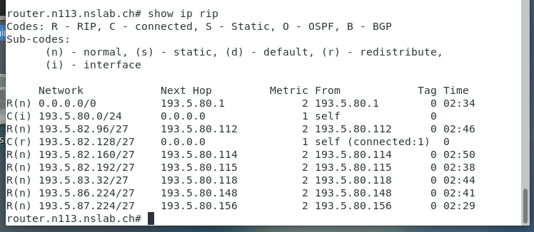
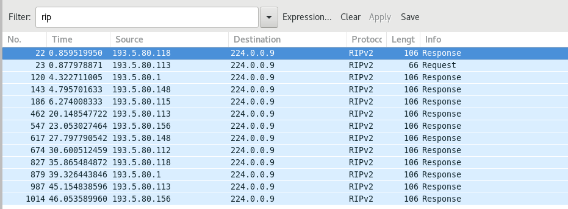
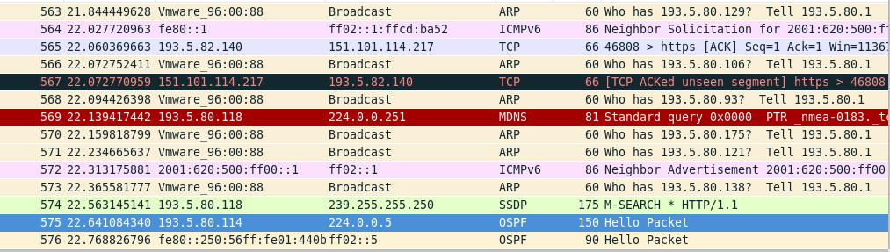
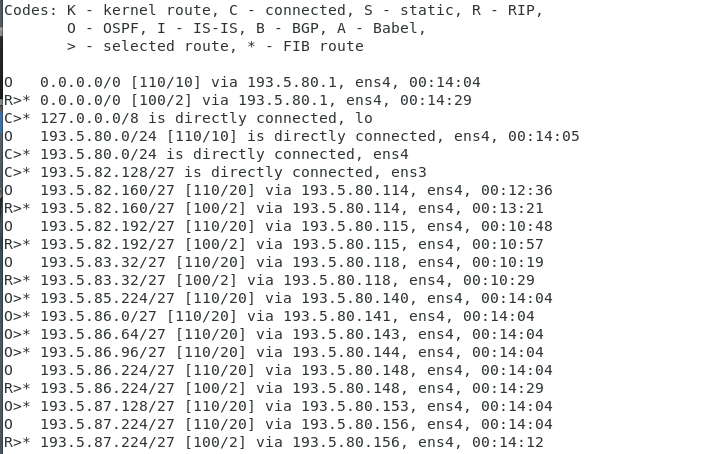
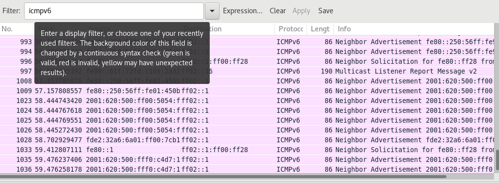
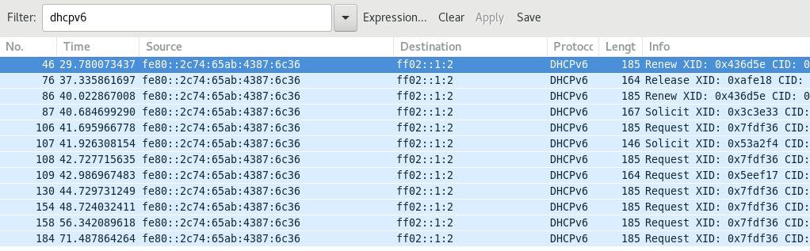
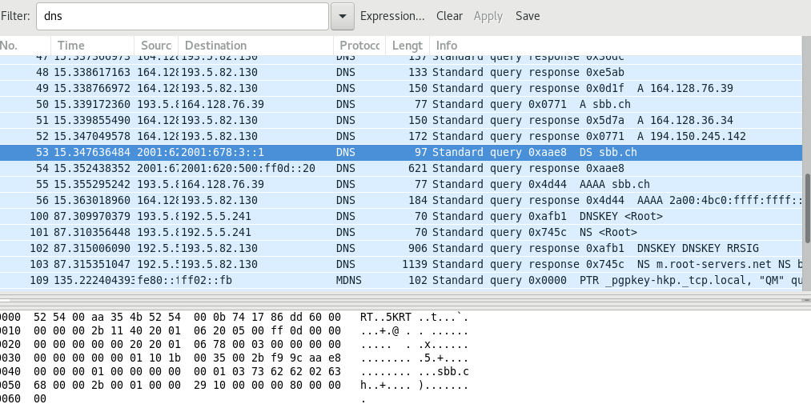

# LAB Journal Serie 1
## Exercise 1
- Set up Git repo
- Set up LAB-Journal
- Group assingment nr: n113
- Familiarize with the virtual lab setup
- Search RHEL 7 Networking guide (TODO)
- Router VM edit config of ENS4 (TODO)

```
Router:
Update /etc/resolve.conf
search n113.nslab.ch nslab.ch
nameserver 193.5.80.80
```
<br/>

Router:
```
Update /etc/hostname
router.n113.nslab.ch
```

Router:
```
Update file: /etc/sysconfig/network-scripts/ifcfg-ens4
DEVICE=ens4
NM_CONTROLLED=no
TYPE=Ethernet
ONBOOT=yes
BOOTPROTO=none
IPADDR=193.5.80.113
PREFIX=27
GATEWAY=193.5.80.1
IPV4_FAILURE_FATAL=yes
Name="System eth0"
```
<br/>

Router:
```
Update file: /etc/sysconfig/network-scripts/ifcfg-ens3
DEVICE=ens3
NM_CONTROLLED=no
TYPE=Ethernet
ONBOOT=yes
BOOTPROTO=none
IPADDR=193.5.82.129
PREFIX=27
GATEWAY=193.5.82.1
IPV4_FAILURE_FATAL=yes
Name="System eth0"
```
<br/>

Router:
```
Update /etc/sysctl.conf
Net.ipv4.ip_forward = 1

sysctl -p /etc/sysctl.conf
systemctl restart network
```
<br/>

Router:
```
ping 8.8.8.8 ✓
traceroute 8.8.8.8 ✓
ping google.com ✓
```
<br/>

Client:
- Set IP to manual: 193.5.82.128/27 Gateway: 193.5.82.129
- Set DNS Server to 193.5.80.80

### 5. März 2019
Tobias Weissert & Thomas Baumann
Network capture


ARP capture


## Exercise 2
Router:
```ping 193.5.82.100 [Redirect host, nexthop: 193.5.80.112]```


Router:
```ip route add 193.5.82.96/27 via 193.5.80.112 dev ens4```

Make route persistent create file /etc/sysconfig/network-scripts/route-ens4
```193.5.82.96/27 via 193.5.80.112 dev ens4```

## Exercise 3
Router: change /etc/sysconfig/network-scripts/ifcfg-ens3 and ifcfg-ens4
```
ONBOOT=no
```

Router: add to /etc/quagga/zebra.conf
```
log file /var/log/quagga/zebra.log
```

```
systemcpl start zebra
```
```
vtysh:
conf t
interface ens3
ip address 193.5.82.129/27
interface ens4
ip address 193.80.113/27
ip route 193.5.82.96/27 193.5.80.112
ip route 193.5.82.96/27 ens4
ip route 0.0.0.0/0 193.5.80.1
write mem
```

### 12. März 2019
Tobias Weissert & Thomas Baumann
```
vtysh:
conf t
no ip route 193.5.82.96/27 193.5.80.112
no ip route 193.5.82.96/27 ens4
no ip route 0.0.0.0/0 193.5.80.1
no ip address 193.5.82.129/27

ip address 193.5.82.129/24
ping 8.8.8.8 ✓
```

## Exercise 4
Router: add to /etc/quagga/ripd.conf
```
log file /etc/quagga/ripd.conf
```
```
systemctl start ripd
Log contains: RIPd starting
```
```
chown quagga.quagga /var/log/qzagga/ripd.conf
vtysh
no ip route 0.0.0.0/ 193.5.80.1
conf t key chain demonet
key 1
key-string demo$rip
interface ens4
ip rip authentication mode md5
ip rip authentication key-chain demonet

router rip
redistribute connected
network 193.5.80.0/24
network ens4
distance 100 193.5.80.0/24
ping 8.8.8.8 ✓
```



## Exercise 5
Router: add to /etc/quagga/ospfd.conf
```
log file /var/log/quagga/ospfd.conf
```
```
systemctl start ospfd
ospf starting
chown quagga.quagga /var/log/qzagga/ospfd.conf
```
```
vtysh coinf t
router ospf
ospf router-id 193.5.80.113
interface ens4
ip ospf authentication message-digest
ip ospf message-digest-key 1 md5 demo$ospf
redistribute connected
network 193.5.80.0/24 area 0.0.0.0
area 0.0.0.0 range 193.5.80.0/24
area 0.0.0.0 authentication message-digest
systemctl enable ospfd
```


## Exercise 6
### 19. März 2019
Tobias Weissert & Thomas Baumann


RIP has a higher priority

```
router rip
distance 120 193.5.82.160/27
ip route 192.5.80.1 0.0.0.0/0 130
```


### 26. März 2019 IETF 104
# LAB Journal Serie 2
### 2. April 2019
Tobias Weissert & Thomas Baumann

```
ip -6 addr
```
```
ping6 www.switch.ch ✓
```



Source address in the router advertisment is the virtual network adapter of the VM host.

```
vtysh conf t interface ens4
ipv6 address 2001:620:500:FF00::FF0D/64
ipv6 address FE80::FF0D/64

vtysh conf t interface ens3
ipv6 address 2001:620:500:FF0D::1/64
ipv6 address FE80::1/64
write mem
```

```
vtysh conf t interface ens4
ipv6 route ::/0 FE80::FC54:FF:FEE7:8557 250
write mem
```
```
ping6 switch.ch ✓
ping6 -i ens4 fe80::1 ✓
```

### 09. April 2019
Tobias Weissert & Thomas Baumann
## Exercise 9
we prefer quagga
```
vtysh conf t interface ens3
no ipv6 ns suppress-ra
ipv6 nd prefix 2001:620:500:FF0D::/64
write mem
```

edit /etc/sysctl.conf
```
net.ipv6.conf.all.forwaring = 1
```

client
```
ip a
ipv6: 2001:620:500:FF0D:1116:6EE0:E63F:5D24/64 ✓
ping6 2001:620:FF00::FF0D ✓

ntptime
ifconfig ens3
echo e0576a5c5d45a0005054fffeaa354b | sha1sum - | cut -c31-40
vtysh interface ens3
ipv6 address fdf8:f06a:90f5::/48
ipv6 nd prefix fdf8:f06a:90f5::/48
```
## Exercise 10
edit /etc/quagga/ripngd.conf
```
log file /var/log/quagga/ospf6.conf
```

```
chown quagga.quagga /var/log/quagga/ripngd.conf
vtysh
router ripng
redistribute connected
```

### 23. April 2019
Tobias Weissert & Thomas Baumann

# Serie 3 DHCP and DNS
## Exercise 12
edit /etc/sysconfig/network
```
NETWORKING=yes
NETWORKING_IPV6=yes
NOZEROCONF=yes
GATEWAY=193.5.82.129
IPV6_DEFAULTDEV=ens3
IPV6_DEFAULTGW=FE80::1
```

edit /etc/sysconfig/network-scripts/ifcfg-ens3
```
BOOTPROTO=static
DEVICE=ens3
ONBOOT=yes
PREFIX=27
IPADDR=193.5.82.130
IPV6INIT=yes
IPV6_AUTOCONF=no
IPV6ADDR=2001:620:500:FF0D::20/64
NM_CONTROLLED=no
```

```
hostnamectl set-hostname ns.n113.nslab.ch
rpm -qa | grep dhcp
```
edit /etc/dhcp/dhcpd.conf
```
option domain-name "ns113.nslab.ch";
option domain-name-servers 193.5.82.130, 193.5.80.80;

default-lease-time 300;
max-lease-time 7200;

log-facility local7;

subnet 193.5.82.128 netmask 255.255.255.224 {
  range 193.5.82.144 193.5.82.158;
  option routers 193.5.80.113;
}
```
```
systemctl start dhcpd
systemctl enable dhcpd
```
Change Client 1 from fix IP address to DHCP
Client 1 got the first IP address in the range 193.5.82.144

edit /etc/dhcp/dhcpd.conf
```
host client1 {
  hardware ethernet 52:54:00:35:84:52;
  fixed-address 193.5.82.150
}
```
Client 1 got the new IP address 193.5.82.150

## Exercise 13
edit /etc/dhcp/dhcpd6.conf
option dhcp6.name-servers 2001:620:500:ff0d::20;
option dhcp6.domain-search "n113.nslab.ch";

```
subnet6 2001:620:500:ff0d::/64 {
  range6 2001:620:500:ff0d::40 2001:620:500:ff0d::2000;
}
```

```
dhcp6 start
```
client1 got a ipv6 address

```
vtysh conf interface ens3
ipv6 nd managed-config-flag
ipv6 nd other-config-flag
ipv6 nd ra-invervall 60
no ipv6 nd suppress-ra
write mem
```

```
host client1 {
  hardware ethernet 52:54:00:35:84:52;
  fixed-address6 2001:620:500:ff0d::50;
}
```
```
dhclient -6 -r
dhclient -6
```


## Exercise 14
Add /var/named/named.conf
```
zone "." IN{
  type hint;
  file "/var/named/named.cache";
};

zone "n113.nslab.ch" {
  type master;
  file "/var/named/fwd-n113.nslab.ch";
};
```

update fwd-n113.nslab.ch
```
;
; BIND Zone File
;
$TTL    300
@       IN      SOA     ns.n113.nslab.ch root.n113.nslab.ch (
                        2018050301      ; Serial
                        600             ; Refresh
                        300             ; Retry
                        7200            ; Expire
                        1200 )          ; Negative Cache TTL

@       IN      NS      ns
ns      IN      A       193.5.82.130
ns      IN      AAAA    2001:620:500:ff0D::20
```

```
systemctl named start
```

less var/log/messages > all zones loaded and running


add to named.conf
```
listen-on port 53 {any}
listen-on-v6 port 53 {any}
```

client01
```
dig any ns.n113.nslab.ch
```

## Exercise 15
create file /var/named/rev-n113.nslab.ch


```
;
; BIND Zone File
;
$TTL    300
@       IN      SOA     ns.n113.nslab.ch root.n113.nslab.ch (
                        2018050301      ; Serial
                        600             ; Refresh
                        300             ; Retry
                        7200            ; Expire
                        1200 )          ; Negative Cache TTL

          IN     NS     ns.113.nslab.ch.
130       IN     PTR    ns.113.nslab.ch.
```

create file /var/named/rev6-n113.nslab.ch
```
;
; BIND Zone File
;
$TTL    300
@       IN      SOA     ns.n113.nslab.ch root.n113.nslab.ch (
                        2018050301      ; Serial
                        600             ; Refresh
                        300             ; Retry
                        7200            ; Expire
                        1200 )          ; Negative Cache TTL

;D.0        IN     NS     ns.113.nslab.ch.
;D.0        IN     PTR    ns.113.nslab.ch.
@           IN     NS     ns.113.nslab.ch.
0.2.0.0.0.0.0.0.0.0.0.0.0.0.0 IN   PTR   ns.n113.nslab.ch.
```

client01
```
dig any 193.5.82.130
```
## Exercise 16
already done earlier

## Exercise 17
```
nslookup sbb.ch
```


