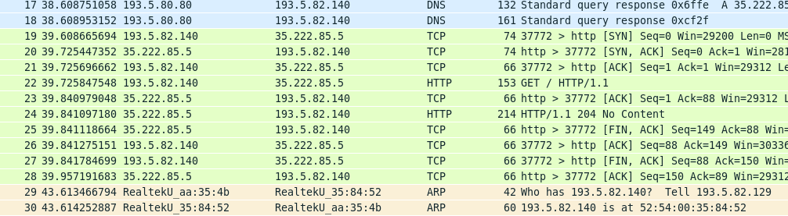
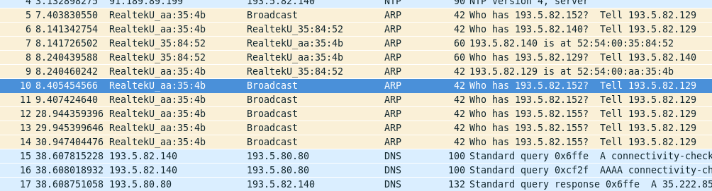
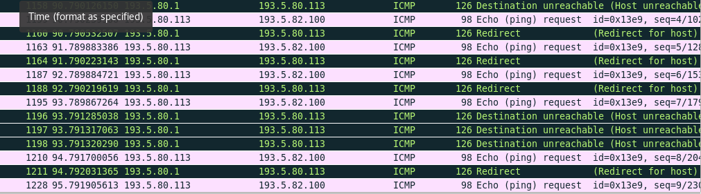

	# LAB Journal
	## Exercise 1
### 19. February 2019
Tobias Weissert & Thomas Baumann 
- Set up Git repo
- Set up LAB-Journal
- Group assingment nr: n113
- Familiarize with the virtual lab setup
- Search RHEL 7 Networking guide (TODO) 
- Router VM edit config of ENS4 (TODO)

```
Router:
Update /etc/resolve.conf
search n113.nslab.ch nslab.ch
nameserver 193.5.80.80
```
<br/>

Router:
```
Update /etc/hostname
router.n113.nslab.ch
```

### 26. Februar 2019
Tobias Weissert & Thomas Baumann<br/>

Router:
```
Update file: /etc/sysconfig/network-scripts/ifcfg-ens4
DEVICE=ens4
NM_CONTROLLED=no
TYPE=Ethernet
ONBOOT=yes
BOOTPROTO=none
IPADDR=193.5.80.113
PREFIX=27
GATEWAY=193.5.80.1
IPV4_FAILURE_FATAL=yes
Name="System eth0"
```
<br/>

Router:
```
Update file: /etc/sysconfig/network-scripts/ifcfg-ens3
DEVICE=ens3
NM_CONTROLLED=no
TYPE=Ethernet
ONBOOT=yes
BOOTPROTO=none
IPADDR=193.5.82.129
PREFIX=27
GATEWAY=193.5.82.1
IPV4_FAILURE_FATAL=yes
Name="System eth0"
```
<br/>

Router:
```
Update /etc/sysctl.conf
Net.ipv4.ip_forward = 1

sysctl -p /etc/sysctl.conf
systemctl restart network
```
<br/>

Router:
```
ping 8.8.8.8 ✓
traceroute 8.8.8.8 ✓
ping google.com ✓
```
<br/>

Client:
- Set IP to manual: 193.5.82.128/27 Gateway: 193.5.82.129
- Set DNS Server to 193.5.80.80

### 5. März 2019
Tobias Weissert & Thomas Baumann
Network capture


ARP capture


## Exercise 2
Router:
```ping 193.5.82.100 [Redirect host, nexthop: 193.5.80.112]```


Router:
```ip route add 193.5.82.96/27 via 193.5.80.112 dev ens4```

Make route persistent create file /etc/sysconfig/network-scripts/route-ens4
```193.5.82.96/27 via 193.5.80.112 dev ens4```

## Exercise 3
Router: change /etc/sysconfig/network-scripts/ifcfg-ens3 and ifcfg-ens4
```
ONBOOT=no
```

Router: add to /etc/quagga/zebra.conf
```
log file /var/log/quagga/zebra.log
```

```
systemcpl start zebra
```
```
vtysh:
conf t
interface ens3
ip address 193.5.82.129/27
interface ens4
ip address 193.80.113/27
ip route 193.5.82.96/27 193.5.80.112
ip route 193.5.82.96/27 ens4
ip route 0.0.0.0/0 193.5.80.1
write mem
```

### 12. März 2019
Tobias Weissert & Thomas Baumann
```
vtysh:
conf t
no ip route 193.5.82.96/27 193.5.80.112
no ip route 193.5.82.96/27 ens4
no ip route 0.0.0.0/0 193.5.80.1
no ip address 193.5.82.129/27

ip address 193.5.82.129/24
ping 8.8.8.8 ✓ 
```

## Exercise 4
Router: add to /etc/quagga/ripd.conf
```
log file /etc/quagga/ripd.conf
```
```
systemctl start ripd
Log contains: RIPd starting
```
```
chown quagga.quagga /etc/qzagga/ripd.conf
vtysh
no ip route 0.0.0.0/ 193.5.80.1
conf t key chain demonet
key 1
key-string demo$rip
interface ens4
ip rip authentication mode md5
ip rip authentication key-chain demonet

router rip 
redistribute connected
network 193.5.80.0/24
network ens4
distance 100 193.5.80.0/24
ping 8.8.8.8 ✓ 
```

